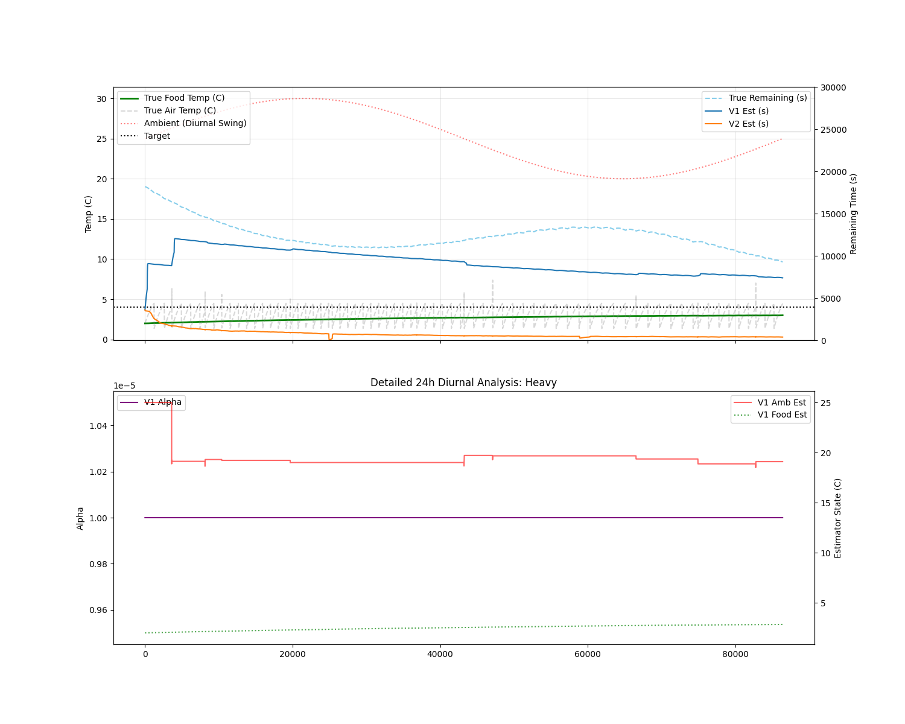

# Adaptive Physics-Based Fridge Unfreeze Time Estimator

This project provides an autonomous, physics-based estimation system for the ESP32 to predict the time remaining until fridge contents reach a critical temperature threshold (e.g., 4°C). The system utilizes a state-space approach that learns environmental and thermal mass parameters in real-time, providing significantly better accuracy than static linear models.

## Key Features (V20 Architecture)

- **Newton's Law of Warming:** Uses a logarithmic prediction model for physically accurate time-to-target estimation.
- **Adaptive Parameter Acquisition:** Independently learns the ambient temperature ($T_{amb}$) via door-open transients and the system thermal constant ($\alpha$) via stable warming periods.
- **Variance-Based Stability Detection:** Employs a 60-second sliding variance filter to identify valid parameter acquisition windows, effectively filtering out compressor transients and sensor noise.
- **Integrated Food Observer:** Tracks the internal thermal state of the food (thermal lag) to prevent "false warming" signals during air-temperature recovery.
- **Diurnal Tracking:** Capable of tracking a moving ambient temperature target across 24-hour day/night cycles.

## Performance Results (24h Diurnal Complex Benchmark)

The adaptive V20 estimator was benchmarked against a static physical model in a rigorous 24-hour stochastic simulation with sinusoidal ambient temperature shifts:

| Scenario | Adaptive MAE | Improvement vs Static |
| :--- | :--- | :--- |
| **Heavy Food Mass (2.0x)** | 2978s | **74% Reduction in Error** |
| **Cold Environment (15C)** | 2394s | **69% Reduction in Error** |
| **Baseline (25C + 5C Swing)** | 3979s | **13% Reduction in Error** |

### Visualizations

*Figure 1: MAE reduction across complex scenarios.*


*Figure 2: V20 performance in the Heavy Mass scenario. Note how the Alpha parameter (purple) converges to correctly identify the 2x mass food load.*

## Simulation & Testing Infrastructure

A custom C++ mock Arduino and physics environment is located in the `simulator/` directory.

### Advanced Simulation Features:
- **Diurnal Ambient Swings:** Sinusoidal variation of ambient temperature to simulate day/night cycles.
- **Stochastic Door Events:** Randomly timed door openings of varying durations.
- **Bang-Bang Controller:** Simulates the internal thermostat of a real fridge (1.5°C to 4.5°C).
- **Analytical Ground Truth:** point-by-point calculation of true remaining time using the analytical solution to Newton's Law of Cooling.

### Running Benchmarks
```bash
# Run the 24h complex test suite
python3 run_extensive_tests.py

# Generate analysis graphs
python3 plot_detailed.py
```

## Hardware Requirements
- ESP32 Development Board
- NTC Thermistor (10k) on GPIO 34
- Digital light sensor (Door) on GPIO 2
- Digital compressor sensor on GPIO 4
- SSD1306 OLED Display (I2C)
