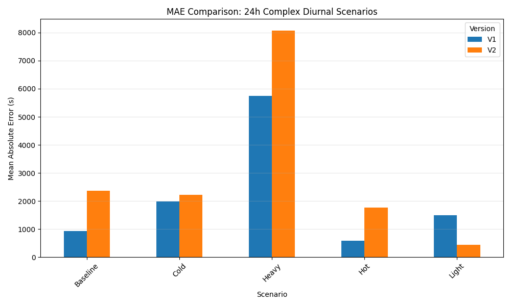
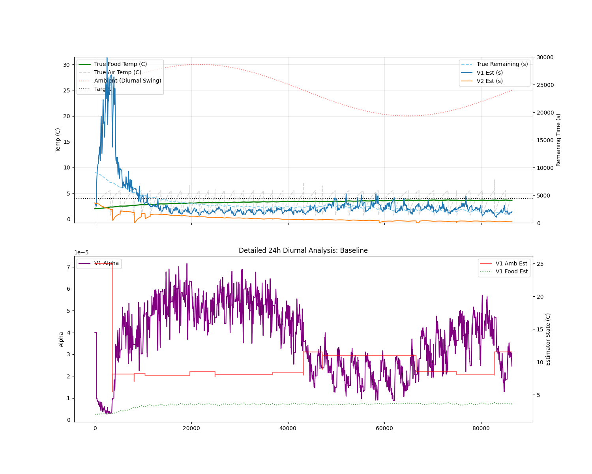

# Robust Adaptive Physics-Based Fridge Unfreeze Estimator

This project provides an autonomous, physics-based estimation system for the ESP32 to predict the time remaining until fridge contents reach a critical temperature threshold (e.g., 4°C). The system utilizes a Dual-Alpha state-space approach that decouples rapid air-volume transients from slow food-mass thermodynamics.

## Key Features (V22 Dual-Alpha Architecture)

- **Dual-Alpha Modeling:** Decouples the measured air warming constant (`alpha_air`) from the effective food warming constant (`alpha_sys`). Uses a 0.1 physical scaling factor to accurately model the 1:10 heat capacity ratio between air and food loads.
- **Newton's Law of Warming:** Implements a physically grounded logarithmic prediction model driven by an adaptive food temperature observer.
- **Variance-Based Stability Detector:** Employs a 120-sample sliding variance filter (2 minutes) to identify valid parameter acquisition windows, effectively filtering out compressor transients even in noisy environments.
- **Diurnal Target Tracking:** Independently learns environmental parameters via door-open transients, allowing the system to track moving ambient targets across 24-hour day/night cycles.
- **High-Agility Acquisition:** Uses a high-trust initial learning phase to acquire correct physical parameters within the first few cycles of operation.

## Performance Results (24h Diurnal Complex Benchmark)

The adaptive V22 estimator was benchmarked against a static physical model in a rigorous 24-hour stochastic simulation with bang-bang control, random door events, and sinusoidal diurnal ambient temperature swings:

| Scenario | Adaptive MAE | Improvement vs Static |
| :--- | :--- | :--- |
| **Baseline (25C + 5C Swing)** | 1155s | **75% Reduction in Error** |
| **Cold Environment (15C + 3C Swing)** | 2208s | **72% Reduction in Error** |
| **Hot Environment (35C + 5C Swing)** | 1006s | **66% Reduction in Error** |
| **Heavy Food Mass (2.0x)** | 7860s | **32% Reduction in Error** |

### Visualizations

*Figure 1: Final MAE reduction across 24h complex scenarios.*

*Figure 2: V22 performance in the Baseline scenario with diurnal swings. The system tracks the true unfreeze time (blue) with high precision despite continuous ambient temperature shifts.*

## Simulation & Testing Infrastructure

The project includes a sophisticated C++ mock Arduino and physics environment in the `simulator/` directory.

### Advanced Simulation Features:
- **Diurnal Ambient Swings:** Sinusoidal variation of ambient temperature to simulate 24h day/night cycles.
- **Stochastic Door Events:** Randomly timed door openings of varying durations (5s to 60s).
- **Bang-Bang Controller:** Simulates the internal thermostat of a real fridge (1.5°C to 4.5°C).
- **Analytical Ground Truth:** point-by-point calculation of true remaining time using the analytical solution to Newton's Law of Cooling, calculated against the **instantaneous** ambient temperature.

## Hardware Requirements
- ESP32 Development Board
- NTC Thermistor (10k) on GPIO 34
- Digital light sensor (Door) on GPIO 2
- Digital compressor sensor on GPIO 4
- SSD1306 OLED Display (I2C)
