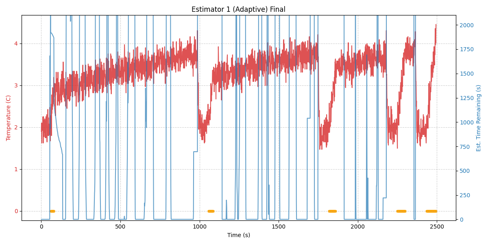
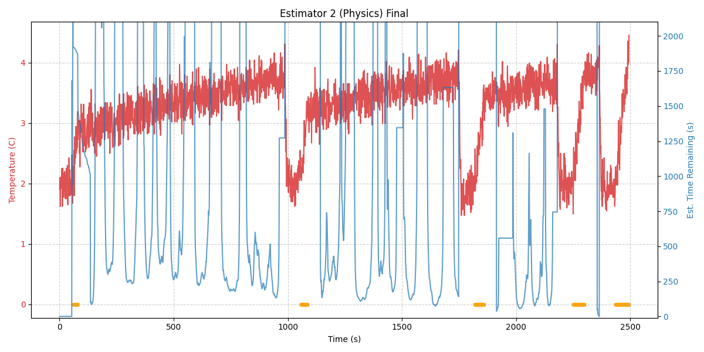

# Fridge Temperature Estimator

This project provides ESP32-based Arduino code to estimate the time remaining until a fridge reaches a critical temperature threshold (e.g., 4°C). It includes two variants of the estimation logic and a comprehensive C++ simulation environment for testing and validation.

## Estimator Variants

### 1. Adaptive Learning Variant (`estimator_esp32.ino`)
Uses a linear extrapolation of the temperature rate-of-change combined with an adaptive correction factor.
- **Internal Proxy:** Estimates "Food Temperature" using a very slow-tracking filter to ignore transient air temperature spikes during door openings.
- **Rate Estimation:** Employs a 60-second Sliding Window Linear Regression (Least Squares) for a stable rate-of-change calculation.
- **Adaptive Learning:** After each warming cycle, it compares the predicted time with the actual elapsed time to adjust a `log_corr` scaling factor.
- **Stability:** Specifically optimized to minimize "jumpiness" in the user interface.

### 2. Physical Model Variant (`estimator2_esp32.ino`)
Uses a physics-inspired model to estimate internal temperature shifts.
- **Non-linear Door Loss:** Models air exchange during door openings using a square-root duration model and exponential decay of the thermal penalty.
- **Internal Proxy:** Also uses the slow-tracking Food Temperature proxy for distance-to-threshold calculations.
- **Rate Estimation:** Uses the same 60-second sliding window regression as V1 for consistency.

## Simulation Environment

A custom C++ simulator is provided in the `simulator/` directory to test the logic without hardware.

### Physics Simulation Features
- **Thermal Mass & Insulation:** Models the heat capacity of the fridge contents and heat leakage through walls.
- **Sensor Noise:** Simulates realistic analog-to-digital converter (ADC) noise.
- **Door Events:** Randomly simulates door openings and their thermal impact.
- **Compressor Cycle:** Simulates the cooling phase when the compressor is active.

### Running the Tests
To build and run the simulation:
```bash
cd simulator
make
./test_v1  # Runs Estimator 1
./test_v2  # Runs Estimator 2
```
This generates `data_v1_rev.csv` and `data_v2_rev.csv`.

### Visualization
The `plot_fridge.py` script generates performance graphs:
```bash
python3 plot_fridge.py
```

## Performance Results

### Estimator 1: Adaptive Learning

*Figure 1: Final performance of the Adaptive variant. The Food Proxy logic ensures the estimate (blue) remains stable even when the air temperature (red) spikes due to door events (orange marks).*

### Estimator 2: Physical Model

*Figure 2: Final performance of the Physics-based variant. The door penalty causes a sharper drop in estimated time during openings, but the Food Proxy maintains overall stability.*

## Hardware Requirements
- ESP32 Development Board
- NTC Thermistor (10k) with 10k resistor divider on GPIO 34
- Digital light sensor (Door status) on GPIO 2
- Digital compressor sensor on GPIO 4
- SSD1306 OLED Display (I2C)
